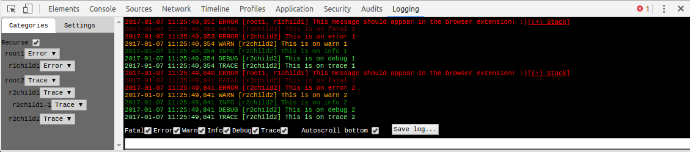

# typescript-logging

Typescript library for logging. Simple and flexible.
Written in typescript, so easily integrates within any Typescript project.

Can also be used in javascript projects, or in the browser directly (es5 compatible).

## Installation

Use npm to install for usage in your project.

~~~
npm install --save typescript-logging
~~~
No additional typings are required, these are included.

Requires typescript 2.1.1+ (tested).

Or download the (minified) javascript bundle and documentation from [here](https://github.com/mreuvers/typescript-logging/tree/master/downloads/bundle/latest).

## Usage

This provides a quick example based on the new way of logging (0.2.0+), please check the documentation section for full documentation for both the latest and previous version.

Config.ts
~~~
import {Category,CategoryLogger,CategoryServiceFactory,CategoryDefaultConfiguration,LogLevel} from "typescript-logging";

// Optionally change default settings, in this example set default logging to Info.
// Without changing configuration, categories will log to Error.
CategoryServiceFactory.setDefaultConfiguration(new CategoryDefaultConfiguration(LogLevel.Info));

// Create categories, they will autoregister themselves.
// This creates one root logger, with 1 child sub category.
export const catRoot = new Category("service");
export const catProd = new Category("product", catRoot);

// Get a logger, this can be retrieved for root categories only (in the example above, the "service" category).
export const log: CategoryLogger = CategoryServiceFactory.getLogger(catRoot);
~~~

ElseWhere.ts
~~~
import {log,catProd} from "./Config"

export class ElseWhere {

  magic(name: string): void {
     // Normal log to category: catProd
     log.info("Performing magic: " + name, catProd);

     // Lambda log to catProd (cheaper)
     log.infoc(() => "Performing magic once more: " + name, catProd);

     log.infoc(() => `With template script: ${name}`, catProd);
  }
}
~~~

With the above example if magic("spell") is executed it will log:
~~~
2016-01-07 11:14:26,273 INFO [product] Performing magic: spell
2016-01-07 11:14:26,274 INFO [product] Performing magic once more: spell
2016-01-07 11:14:26,275 INFO [product] With template script: spell
~~~

## Documentation

Since version 0.2.0 the documentation has been split off in 2 sections.
* Latest current documentation: [Latest documentation](docs/latest.md)
* Version 0.1.3 which refers to the old documentation: [Stable version 0.1.3](docs/stable_0.1.3.md)

Please note that the latest version is backwards compatible with 0.1.3.

## Typescript Logging Developer Extension

Starting with version 0.2.0+ a chrome developer extension has been created to easily allow changing log levels and filtering of logging for an application
that uses typescript logging.

Please visit: [typescript-logging-extension](https://github.com/mreuvers/typescript-logging-extension) on how to get this.

Note: The extension only integrates with the categorized way of logging.

## Build

To build locally:

~~~
npm run build
~~~

## Tests

To run the tests:

~~~
npm run test
~~~

## Bugs

We all wish there were none in our software, but alas. If you encounter a bug please log it in the issue tracker.

## Contributing

Feel free to contribute or come up with great ideas, please use the issue tracker for that.

If you add/change new functionality and want it merged to master, please open a pull request. Also add tests for it (spec directory).
Some things may not fit the library and could be rejected, so if you are unsure please ask first before wasting your valuable time.

## History
* 0.2.0-beta4 (current release)
  * Drop / move types (they can cause issues with es6 ts projects)
  * Added 'setConfigurationCategory(...)' to CategoryServiceFactory to allow config for specific category (and childs).
  * Update documentation
* 0.2.0-beta3
  * Update latest documentation with example for custom logger
  * Expose CategoryLogFormat, was missing.
  * Add source maps to the latest download as well.
* 0.2.0-beta2
  * Fix missing optionals in Logger interface
  * Hopefully fix @node reference declaration issues by adding typings (compile would fail, feels like a TS bug but not sure).
* 0.2.0-beta1
  * Categorized logging (new feature)
  * Categorized logging supports chrome developer extension
  * Updated and split documentation (pre 0.2 and latest)
  * Standard logging (0.1.3) remains compatible (does not integrate with chrome extension)
* 0.1.3 No api changes, release ok.
  * Updated documentation (slightly changed examples, added example how to import, added additional logger api)
  * Fix that messages get logged in proper order always (due to using a promise for error resolving, they could get out of order)
* 0.1.2 No changes (npm related), release ok.
* 0.1.1 No changes (npm related), do not use.
* 0.1.0 Initial release, do not use.
